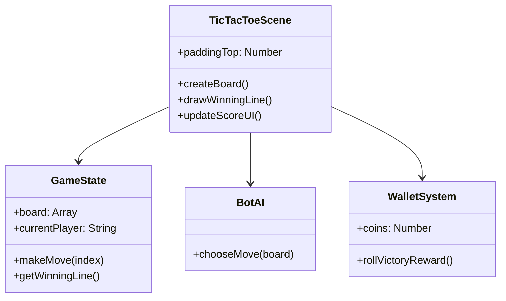

# Проект: Tic-Tac-Toe Neon Phaser Edition #

Автор проекта: Наталья Репкина
Реализация классической игры «Крестики-нолики» на движке Phaser 3 с неоновым визуальным стилем, системой наград и умным противником.

1. Демо https://tic-tac-toe-nuttik.netlify.app

2. UML Диаграмма (минимальная)
Для описания логики использована упрощенная диаграмма классов, разделяющая состояние, визуальное представление и бота.
https://drive.google.com/drive/folders/1yN0sihife_OKYCaFk4-9Dp71sS0V3YBZ

3. Использованные ИИ-агенты
Cursor AI (Composer/Chat): Основной инструмент написания и рефакторинга кода.

Модели: Claude 3.5 Sonnet (для сложной логики и анимаций) и GPT-4o (для быстрой правки верстки и UI).

4. Примеры промптов (Workflow в Cursor)
Для работы использовался стандартный воркфлоу Cursor: индексация файлов проекта позволила ИИ понимать контекст всей сцены Phaser без копирования кода в чат.

Промпт 1: Инициализация (Composer)

  "Разработай архитектуру игры «Крестики-нолики» на Phaser 3 в неоновом стиле.

  Используй объектно-ориентированный подход: раздели код на GameState (управление сеткой и валидация побед), BotAI (интеллектуальный противник) и TicTacToeScene (визуализация и ввод).

  В классе BotAI реализуй многоуровневую логику принятия решений:

  Приоритет 1: Поиск хода для собственной немедленной победы.

  Приоритет 2: Блокировка победного хода игрока.

  Приоритет 3: Захват центральной клетки и углов.

  Добавь параметр mistakeChance (0.3), чтобы бот иногда совершал случайные ходы для баланса.

  Настрой рабочую область 480x760 с темным фоном #0B0E14 и предусмотри отступ сверху (paddingTop) для панели счета."

Промпт 2: Визуальный стиль и анимации (Chat)

  "Добавь неоновый стиль для X и O. Крестик (голубой 0x00f2ff) должен рисоваться двумя линиями с эффектом свечения (Glow). Нолик (розовый 0xff007a) должен плавно рисоваться как дуга через Tween. Добавь победную линию: она должна быть золотистой, мигать и выходить за границы клеток (удлиняться)."

Промпт 3: Реализация UI и Кошелька (Composer)

  "Добавь под игровым полем систему вознаграждений. При победе игрока начисляй случайное количество монет (10-50) в WalletSystem с анимацией всплывающего текста. Добавь кнопку 'Новая игра', которая при нажатии (pointerdown) становится желтой, а текст меняет цвет на темный."

Промпт 4: Рефакторинг шапки (Chat)

  "Перенеси счет игрока и бота в верхнюю часть экрана над полем. Используй иконки 👨‍🚀 для игрока и 🤖 для бота. Выровняй их и текстовые значения счета идеально по центру по вертикали, используя setOrigin(0, 0.5) и scoreY. Убедись, что иконки не обрезаются краем холста."

5. Что пришлось исправить или переписать вручную
Несмотря на высокую точность ИИ, потребовались ручные правки для "тонкой настройки":

  Геометрия и координаты: Изначально иконки в верхней панели обрезались из-за низкого значения paddingTop. Вручную были подобраны значения paddingTop: 96 и scoreY: 42, а также увеличена высота Phaser.Game до 760px.

  Логика обновления счета: Исправлена опечатка в методе updateScoreUI, где для отображения счета бота ошибочно проверялось свойство побед игрока.

  События кнопки: Добавлены обработчики pointerout и pointerup для кнопки перезапуска, чтобы визуальное состояние (желтый цвет) сбрасывалось, если пользователь увел курсор с кнопки, не отпуская его.

  Был переписан класс BotAI. Добавлен коэффициент mistakeChance, чтобы бот иногда совершал случайные ходы, имитируя человеческий стиль игры и давая игроку шанс на победу

6. Видео демонстрация
https://drive.google.com/drive/folders/1yN0sihife_OKYCaFk4-9Dp71sS0V3YBZ

7. Код проекта на гитхабе https://github.com/NataRep/tic-tac-toe